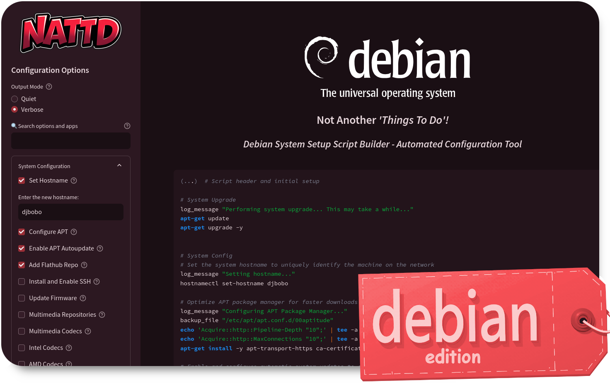

# Debian: Not Another 'Things To Do'!



<p align="center">
  
  
  
  
  <a href="https://mktr.sbs/linkedin"></a>
</p>

**Initial System Setup Shell Script Builder for Debian**

> ⚠️ **Beta Testing Notice**: This is a Debian adaptation of the original [Fedora Things To Do](https://github.com/k-mktr/fedora-things-to-do) project. While the core functionality has been ported, this version is currently in beta and requires thorough testing. Please use with caution and report any issues you encounter.

## Overview

This project offers a Streamlit-based web application for generating a tailored shell script to set up a new Debian installation. The app provides an intuitive interface for choosing system configurations, applications, and customization options. This adaptation maintains the user-friendly approach of the original Fedora project while implementing Debian-specific package management and system configurations.

## Features

- **System Configuration**: 
  - Set hostname
  - Configure APT and enable auto-updates
  - Install SSH
  - Check for firmware updates
  - Enable non-free and contrib repositories
  - Configure multimedia codecs
- **Essential Apps**: Install popular command-line tools and utilities with detailed descriptions
- **Additional Apps**: Choose from a wide range of applications categorized by purpose:
  - Internet & Communication (browsers, email clients, messaging apps)
  - Office & Productivity
  - Coding & DevOps
  - Media & Graphics
  - Gaming & Emulation
  - System Tools
  - Remote Access & Networking
  - File Sharing & Download
- **Customization**: 
  - Install fonts
  - Install themes
  - Configure power settings
  - Set up development environments
- **Advanced Options**: Add custom shell commands
- **Script Preview**: View the generated script before downloading
- **Output Mode Selection**: Choose between Quiet and Verbose modes

## Requirements

- Python 3.7+
- Streamlit
- A modern web browser
- Debian-based system (for running the generated scripts)

## Installation

1. Clone this repository:
   ```
   git clone https://github.com/k-mktr/debian-things-to-do.git
   cd debian-things-to-do
   ```

2. Install the required Python packages:
   ```
   pip install streamlit pip --upgrade
   ```

## Usage

1. Run the Streamlit app:
   ```
   streamlit run app.py
   ```

2. Open your web browser and navigate to the URL provided by Streamlit (usually `http://localhost:8501`)

3. Use the sidebar to select your desired configuration options

4. Choose the Output Mode (Quiet or Verbose)

5. (Optional) Add custom shell commands in the Advanced section

6. Click "Build Your Script" to create your customized script

7. Review the script preview and click "Download Your Script" to save it

8. Make the script executable and run it on your Debian system

## ⚠️ Important Notes

1. **Testing Status**: This Debian adaptation is currently in beta testing. While core functionality has been adapted, some features may require further testing and refinement.

2. **System Changes**: The generated script will make system-wide changes. Always review the script contents before running it on your system.

3. **Compatibility**: This version is specifically designed for Debian-based systems. Do not use it on other distributions.

4. **Reporting Issues**: If you encounter any problems, please open an issue on GitHub with detailed information about the error and your system configuration.

## Contributing

Contributions are welcome! We especially need help with:
- Testing the scripts on different Debian configurations
- Identifying and fixing Debian-specific issues
- Suggesting Debian-specific improvements
- Reporting bugs or compatibility issues

## License

This project is licensed under the GNU General Public License v3.0 - see the [LICENSE](LICENSE) file for details.

## Acknowledgements

- Original [Fedora Things To Do](https://github.com/k-mktr/fedora-things-to-do) project for the inspiration and base code
- Debian Project for their excellent Linux distribution
- Streamlit for their intuitive app framework
- All contributors of Open Source Software

## Contact

For questions, feedback, or support:
- Open an issue on this repository
- Contact the author: [Karl Stefan Danisz](https://mktr.sbs/linkedin)

## FAQ

### Is this script safe to run on my Debian system?
While the script is designed to be safe, it's currently in beta testing. Always review the script contents before running it and ensure you have a backup of important data.

### What Debian versions are supported?
The script is being tested on the latest stable release of Debian. Support for other versions may vary.

### Can I modify the script after it's generated?
Yes! The generated script is just a starting point. You can modify it to better suit your needs, just be careful to maintain proper syntax.

### What if I encounter an error?
Check the log file (default location: `/var/log/debian_things_to_do.log`) for details. Please report any issues on our GitHub repository to help improve the project.

### Can I run the script multiple times?
While many operations are designed to be idempotent, it's safest to run the script once on a fresh Debian installation. For subsequent changes, generate a new script with only the additional modifications needed.

### Why not use Ansible instead of a shell script?
While Ansible is a powerful tool for configuration management, our project prioritizes simplicity and transparency for end-users. The shell script approach allows users to easily see and understand exactly what commands will be executed on their system. It doesn't require additional software installation and is more approachable for users who may not be familiar with Ansible. However, for more complex setups or managing multiple systems, Ansible could be a viable alternative.

Created with ❤️ for Open Source
