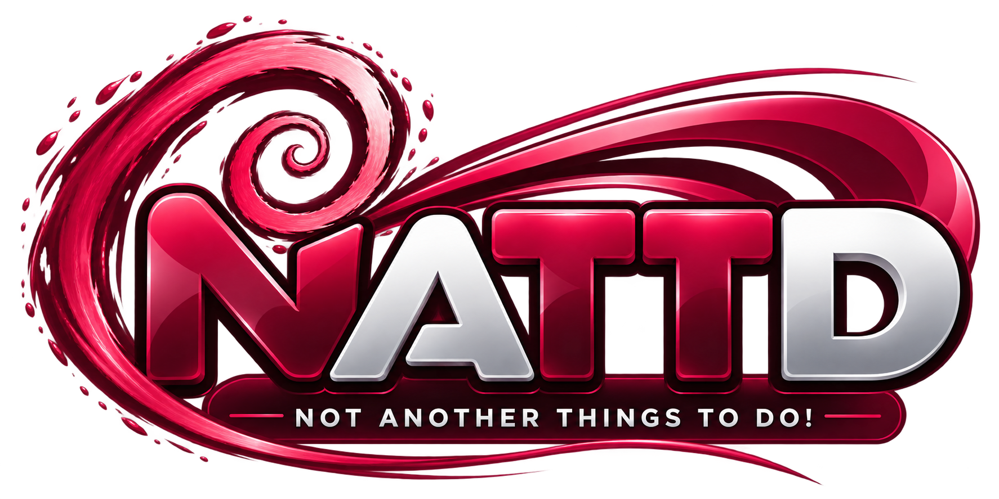

# Debian: Not Another 'Things To Do'!



<p align="center">
  <a href="https://github.com/k-mktr/debian-things-to-do/actions/workflows/ci.yml"></a>
  
  
  
  <a href="https://www.linkedin.com/in/karol-stefan-danisz/"></a>
</p>

**Initial System Setup Shell Script Builder for Debian**

> This is a Debian adaptation of the [Fedora Things To Do](https://github.com/k-mktr/fedora-things-to-do) project. The app, test suite and CI pipeline mirror the Fedora edition; package management is fully apt-native and the catalog is verified against **Debian 13 (trixie)**.

## Latest Changes

*(As of 2026-09-29)*

- **Debian 13 (trixie) compatibility pass, verified in a Debian 13 container:**
  - Multimedia Repositories option rewritten: `software-properties-common`/`add-apt-repository` were **removed from trixie** — replaced with a deb822-safe `sed` that enables `contrib`, `non-free` and `non-free-firmware` in the sources
  - Steam dependencies: `libgl1-mesa-glx:i386` (removed in trixie) → `libgl1:i386`
  - PPSSPP: APT variant dropped (package not in trixie), Flatpak kept
  - Multimedia codecs: `ubuntu-restricted-extras` (Ubuntu-only package) → `libavcodec-extra`
  - `configure_apt` no longer depends on `software-properties-common`
- Builder fix: selecting any codec option now automatically enables the multimedia repositories (previously a phantom option key made that a no-op)
- Docker install made idempotent (guarded `groupadd`) and the destructive `rm -rf ~/.docker` removed
- **UX niceties**: Select all / Clear all on Essential Apps and per category on Additional Applications (search-aware), selection counters
- **⚡ Quick Setup profiles**: one-click presets plus export/import of custom profiles as JSON (ported from the Fedora edition, presets adapted to the Debian catalog)
- **Robust script template**: ERR-trap with a ✅/⚠️ failure summary and a metadata header in every generated script
- **Freshness radar** (`check_freshness.py` + weekly CI job): verifies every Flatpak ID and URL in the catalog against Flathub and live HTTP checks; auto-manages a `stale-links` issue — reporting only, never blocking
- **CI pipeline**: pytest suite (structure, builder end-to-end, freshness, UX widgets), generated-script shell-syntax checks, ruff lint (blocking, pinned ruleset)
- Fixed all dead `mktr.sbs` links (domain is gone) — replaced with LinkedIn/GitHub profiles
- Windows Fonts download switched to the `win-fonts.zip` GitHub release asset (© Microsoft — requires a valid Windows license; unchanged notice)
- New Debian-red logo/cover artwork

## Overview

This project offers a Streamlit-based web application for generating a tailored shell script to set up a new Debian installation. The app provides an intuitive interface for choosing system configurations, applications, and customization options. This adaptation maintains the user-friendly approach of the original Fedora project while implementing Debian-specific package management and system configurations.

## Features

- **System Configuration**:
  - Set hostname
  - Configure APT and enable auto-updates
  - Install SSH
  - Check for firmware updates
  - Enable non-free and contrib repositories
  - Configure multimedia codecs (FFmpeg, Intel/AMD hardware acceleration)
  - Virtualization tools (QEMU/KVM + libvirt)
- **Essential Apps**: Install popular command-line tools and utilities with detailed descriptions
- **Additional Apps**: Choose from a wide range of applications categorized by purpose:
  - Internet & Communication (browsers, email clients, messaging apps)
  - Office & Productivity
  - Coding & DevOps (Docker CE, VSCodium, Ansible, Podman…)
  - Media & Graphics
  - Gaming & Emulation (Steam, RetroArch, Dolphin…)
  - System Tools
  - Remote Access & Networking
  - File Sharing & Download
- **Customization**:
  - Install fonts (Windows fonts via Core Fonts or the win-fonts pack)
  - Install themes and icon themes
  - Configure power settings
  - Set up development environments (Zsh, Oh My Zsh, Miniconda)
- **⚡ Quick Setup Profiles**: one-click presets (Developer, Creative, Minimal…) plus save/load of custom profiles as JSON
- **UX niceties**: search-aware Select all / Clear all per section and live selection counters
- **Advanced Options**: Add custom shell commands
- **Script Preview**: View the generated script before downloading
- **Output Mode Selection**: Choose between Quiet and Verbose modes

## Requirements

- Python 3.12+
- Streamlit 1.49+
- A modern web browser
- Debian-based system (for running the generated scripts)

## Installation

1. Clone this repository:
   ```
   git clone https://github.com/k-mktr/debian-things-to-do.git
   cd debian-things-to-do
   ```

2. Install the required Python packages:
   ```
   pip install -r requirements.txt
   ```

## Usage

1. Run the Streamlit app:
   ```
   streamlit run app.py
   ```

2. Open your web browser and navigate to the URL provided by Streamlit (usually `http://localhost:8501`)

3. Use the sidebar to select your desired configuration options

4. Choose the Output Mode (Quiet or Verbose)

5. (Optional) Add custom shell commands in the Advanced section

6. Click "Build Your Script" to create your customized script

7. Review the script preview and click "Download Your Script" to save it

8. Make the script executable and run it on your Debian system

## ⚠️ Important Notes

1. **System Changes**: The generated script will make system-wide changes. Always review the script contents before running it on your system.

2. **Compatibility**: This version is specifically designed for Debian-based systems (verified against Debian 13 "trixie"). Do not use it on other distributions.

3. **Reporting Issues**: If you encounter any problems, please open an issue on GitHub with detailed information about the error and your system configuration.

## Contributing

Contributions are welcome! We especially need help with:
- Testing the scripts on different Debian configurations
- Identifying and fixing Debian-specific issues
- Suggesting Debian-specific improvements
- Reporting bugs or compatibility issues

## License

This project is licensed under the GNU General Public License v3.0 - see the [LICENSE](LICENSE) file for details.

## Acknowledgements

- Original [Fedora Things To Do](https://github.com/k-mktr/fedora-things-to-do) project for the inspiration and base code
- Debian Project for their excellent Linux distribution
- Streamlit for their intuitive app framework
- All contributors of Open Source Software

## Contact

For questions, feedback, or support:
- Open an issue on this repository
- Contact the author: [Karol Stefan Danisz](https://www.linkedin.com/in/karol-stefan-danisz/)

## FAQ

### Is this script safe to run on my Debian system?

The script makes system-wide changes, so always review its contents first (the preview feature shows you exactly what will run) and keep a backup of important data. The app itself and the catalog are covered by automated tests and CI.

### What Debian versions are supported?

The catalog and commands are verified against **Debian 13 (trixie)** — including packages that were removed from trixie's repositories. Older releases may work partially but are not tested.

### Can I modify the script after it's generated?

Yes! The generated script is just a starting point. You can modify it to better suit your needs, just be careful to maintain proper syntax.

### What if I encounter an error?

Check the log file (default location: `/var/log/debian_things_to_do.log`) for details. Please report any issues on our GitHub repository to help improve the project.

### Can I run the script multiple times?

Many operations are designed to be idempotent (e.g. Docker installation guards against re-runs), but it's safest to run the script once on a fresh Debian installation. For subsequent changes, generate a new script with only the additional modifications needed.

### Why not use Ansible instead of a shell script?

While Ansible is a powerful tool for configuration management, our project prioritizes simplicity and transparency for end-users. The shell script approach allows users to easily see and understand exactly what commands will be executed on their system. It doesn't require additional software installation and is more approachable for users who may not be familiar with Ansible. However, for more complex setups or managing multiple systems, Ansible could be a viable alternative.

Created with ❤️ for Open Source
